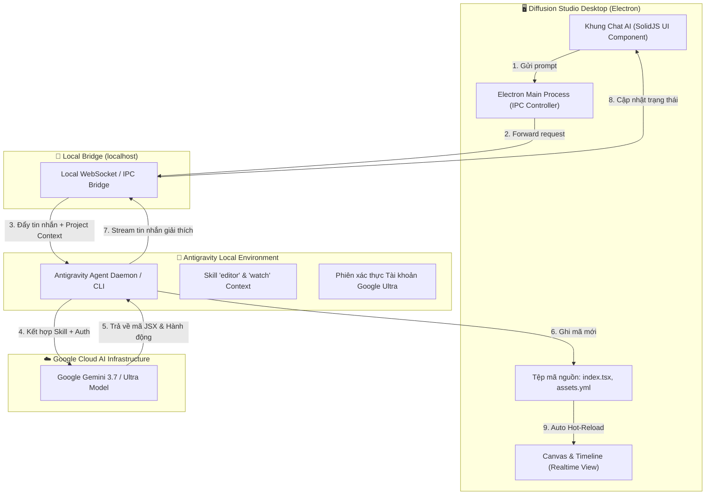
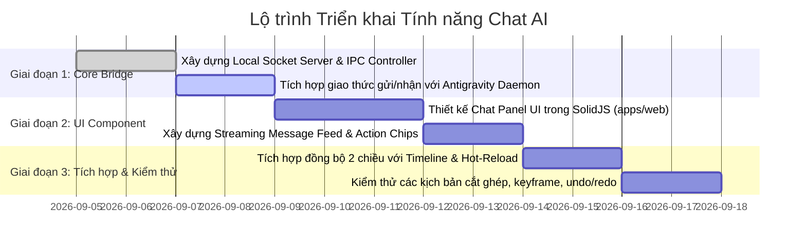

# TÀI LIỆU THIẾT KẾ KỸ THUẬT & KẾ HOẠCH TRIỂN KHAI
## Tích hợp Khung Chat AI (Antigravity Ultra Bridge) trực tiếp vào UI Diffusion Studio Desktop

---

## 1. Tổng quan & Mục tiêu

### 1.1. Bối cảnh
**Diffusion Studio** là trình chỉnh sửa video dạng code-based (SolidJS/JSX). Hiện tại, việc điều khiển AI chỉnh sửa video đang được thực hiện từ bên ngoài thông qua Antigravity IDE và công cụ dòng lệnh `dapi` CLI.

### 1.2. Mục tiêu
Xây dựng một **Khung Chat AI (AI Assistant Panel)** tích hợp trực tiếp vào giao diện của ứng dụng **Diffusion Studio Desktop (Electron)**. Người dùng có thể trực tiếp chat, ra lệnh chỉnh sửa video, tạo hiệu ứng, thêm phụ đề ngay trong giao diện dựng phim mà không cần chuyển qua lại giữa các cửa sổ ứng dụng.

### 1.3. Cơ chế cốt lõi (Core Mechanism)
- **Tận dụng gói Antigravity Ultra có sẵn**: Kết nối nội bộ qua Local Agent Bridge trên máy của người dùng (`localhost`), cho phép sử dụng các model AI mạnh nhất của Google (Gemini 3.7 / Ultra) mà không phát sinh thêm chi phí API riêng.
- **Phản hồi thời gian thực (Realtime & Streaming)**: Hiển thị phản hồi từng chữ (text streaming) và cập nhật tức thì lên Timeline & Canvas.

---

## 2. Kiến trúc Hệ thống (System Architecture)



---

## 3. Đặc tả Luồng Hoạt động (Step-by-step Data Flow)

1. **Khởi tạo Ngữ cảnh (Context Packing)**:
   - Khi người dùng gửi một yêu cầu (ví dụ: *"Cắt từ giây thứ 3 đến 6 và tạo hiệu ứng zoom-in"*).
   - Ứng dụng tự động đóng gói ngữ cảnh gồm:
     - Câu lệnh của người dùng.
     - Nội dung hiện tại của `index.tsx`.
     - Danh sách tài nguyên trong `assets.yml`.
     - Vị trí con trỏ thời gian hiện tại (`currentTime`).
2. **Chuyển tiếp qua Local Bridge**:
   - Gửi gói dữ liệu qua kết nối WebSocket nội bộ (`ws://127.0.0.1:port`) tới tiến trình Antigravity Agent.
3. **Xử lý tại Google Cloud AI**:
   - Antigravity gắn phiên xác thực Ultra + Hướng dẫn kỹ năng (`editor` skill) gửi lên Google Gemini Ultra.
   - Model AI phân tích, tính toán timing và sinh đoạn mã JSX chính xác kèm keyframes.
4. **Áp dụng & Hiển thị Đồng thời (Bi-directional Sync)**:
   - **Stream Text**: Lời giải thích của AI được stream về khung Chat trên UI theo thời gian thực.
   - **Ghi mã**: Mã nguồn mới được ghi vào `index.tsx`.
   - **Render Canvas**: Trình theo dõi tệp (`watchProject`) kích hoạt, Canvas & Timeline tự động vẽ lại hiệu ứng ngay trước mắt người dùng.

---

## 4. Thiết kế Giao diện Người dùng (UI/UX Design)

### 4.1. Vị trí & Bố cục (Layout Options)
- **Sidebar Tab bên phải (Khuyên dùng)**:
  - Tích hợp thêm 1 Tab **"AI Assistant"** (biểu tượng ✨) nằm cạnh tab **Inspector** và **Soundboard**.
  - Khi mở tab, giao diện mở rộng thành khung chat chuyên nghiệp.
  - Hỗ trợ phím tắt bật/tắt nhanh: `Cmd + J` hoặc `Cmd + K`.

### 4.2. Các thành phần trên Giao diện Chat
1. **Header**:
   - Đèn báo trạng thái kết nối: `🟢 Antigravity Ultra Connected` / `🔴 Disconnected`.
   - Nút `Clear History` (Xóa hội thoại) và nút `Settings`.
2. **Message Feed (Khu vực tin nhắn)**:
   - Tin nhắn người dùng & tin nhắn AI dạng Markdown.
   - **Step Indicator**: Hiển thị trạng thái AI đang làm việc (ví dụ: *Đang phân tích timeline...* -> *Đang thêm keyframe...* -> *Hoàn tất*).
   - **Code Diff Box**: Hiển thị nút bấm so sánh nhanh đoạn code đã thay đổi kèm nút `Undo` (Hoàn tác).
3. **Quick Action Chips (Gợi ý thao tác nhanh)**:
   - `[✂️ Cắt tại Playhead]`
   - `[🔍 Zoom in Keyframe]`
   - `[📝 Tạo phụ đề tự động]`
   - `[⚡ Thêm intro chữ]`
4. **Input Area**:
   - Khung nhập văn bản đa dòng (Auto-grow Textarea).
   - Nút gửi và phím tắt `Enter` (Gửi) / `Shift + Enter` (Xuống dòng).

---

## 5. Đặc tả Giao thức & Cấu trúc Dữ liệu (Protocol Specification)

### 5.1. Định dạng Tin nhắn Gửi đi (Client -> Agent)
```json
{
  "type": "CHAT_REQUEST",
  "requestId": "req_8f93ab21",
  "prompt": "Cắt video giữ lại từ 0s đến 4s và phóng to dần",
  "context": {
    "projectDir": "/Users/hoangkien/Movies/Diffusion Studio/wild-storm-4-sep",
    "currentTime": 2.5,
    "sourceCode": "...",
    "manifest": { ... }
  }
}
```

### 5.2. Định dạng Tin nhắn Phản hồi (Agent -> Client Stream)
```json
{
  "type": "CHAT_STREAM",
  "requestId": "req_8f93ab21",
  "chunk": "Tôi đã cập nhật timeline giữ lại đoạn 0-4s và thêm keyframe zoom...",
  "status": "APPLYING_EDITS", // THINKING | APPLYING_EDITS | DONE | ERROR
  "edits": {
    "file": "index.tsx",
    "applied": true
  }
}
```

---

## 6. Phân tích Rủi ro & Giải pháp Kỹ thuật

| Rủi ro kỹ thuật | Mức độ | Nguyên nhân | Giải pháp xử lý triệt để |
| :--- | :---: | :--- | :--- |
| **Mất kết nối Agent** | Trung bình | Antigravity chưa được bật hoặc bị tắt đột ngột. | Hiển thị thông báo trạng thái rõ ràng; Electron có cơ chế tự động khởi chạy tiến trình agent ngầm khi mở app. |
| **Xung đột ghi đè (Race condition)** | Thấp | Người dùng vừa kéo thả chuột vừa gửi lệnh chat cùng lúc. | Tạm khóa nhẹ thao tác kéo thả khi AI đang ghi tệp; tận dụng hệ thống `markSelfWrite` và `EditWriter` để đồng bộ AST an toàn. |
| **Độ trễ phản hồi** | Thấp | Model Ultra suy nghĩ phức tạp mất 2-3s. | Sử dụng cơ chế Streaming Text (chữ ra từng từ) kèm thanh tiến trình trực quan. |
| **Lỗi biên dịch code JSX** | Thấp | AI sinh cú pháp thẻ JSX không hợp lệ. | Tận dụng cơ chế `compileProject` có sẵn: nếu code lỗi, app giữ nguyên bản render trước đó và thông báo lỗi trên chat để AI tự sửa lại. |

---

## 7. Kế hoạch Triển khai (Implementation Roadmap)



### Chi tiết các bước thực hiện:
- **Bước 1**: Xây dựng mô-đun **Bridge Controller** trong `apps/desktop/src/agent-bridge.ts` để quản lý kết nối socket với Antigravity.
- **Bước 2**: Tạo giao diện **Chat Assistant Component** trong `apps/web/src/components/sidebar-right/chat-panel.tsx`.
- **Bước 3**: Gắn phím tắt (`Cmd + J`) và nút bấm trên thanh công cụ/sidebar.
- **Bước 4**: Kết nối luồng xử lý: Chat Input -> Local Bridge -> Antigravity Ultra -> Tự động ghi `index.tsx` -> Canvas render tức thì.
- **Bước 5**: Kiểm thử tổng thể các tác vụ (cắt video, thêm keyframe, thêm phụ đề, hoàn tác).

---

> [!TIP]
> **Tài liệu này đã được lưu vào hệ thống.** Khi bạn sẵn sàng bắt đầu lập trình, chúng ta có thể bám sát thiết kế này để triển khai từng bước một cách chuẩn xác và nhanh chóng nhất.
